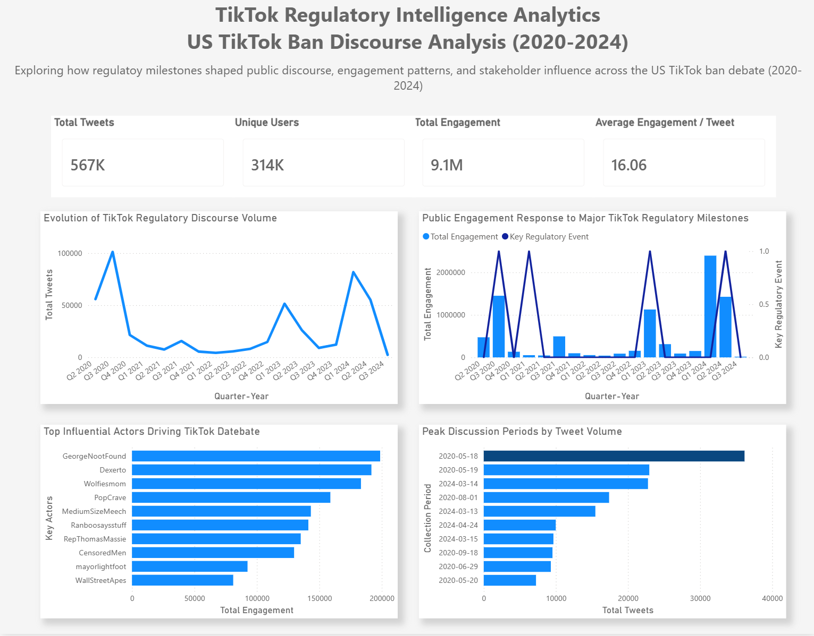
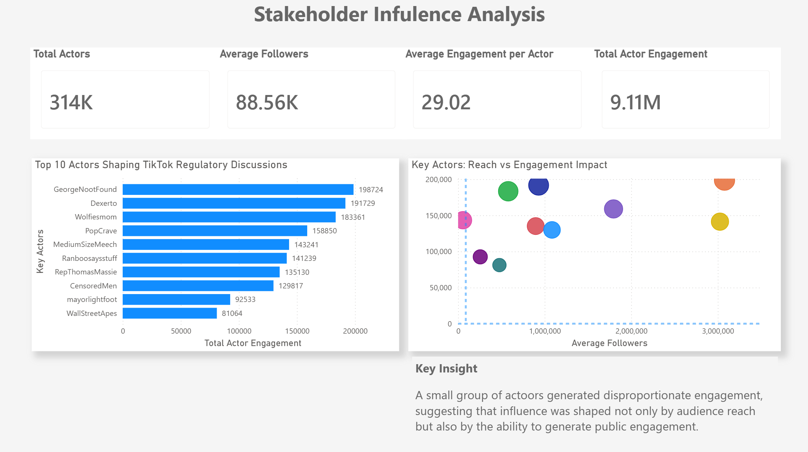
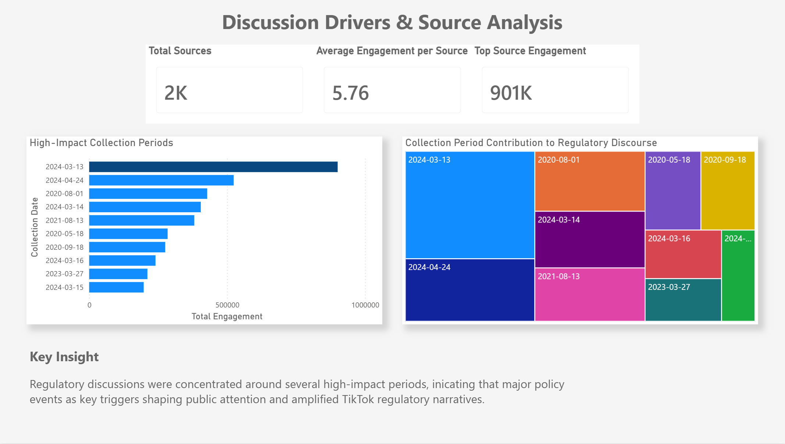
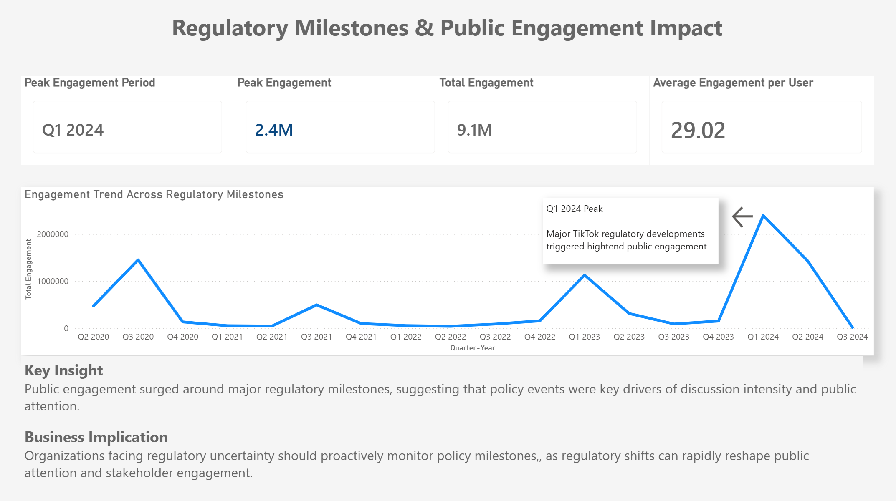

# TikTok Regulatory Intelligence & Stakeholder Analytics

**Independent Business Intelligence Project | Power BI · Power Query · DAX**

An end-to-end analytics project examining **567K cleaned public Twitter/X posts about TikTok regulation in the United States** between 2020 and 2024. The project combines engagement trends, account-level influence, collection-period patterns, and regulatory milestones in a four-page Power BI report.

> This project analyzes public discussion **about TikTok** on Twitter/X. It does not use TikTok platform data or represent TikTok's internal analytics.

## Project at a Glance

| Scope | Result |
|---|---:|
| Analysis period | 2020-2024 |
| Cleaned posts | 567K |
| Unique users | 314K |
| Recorded engagement | 9.1M |
| Average engagement per post | 16.06 |
| Peak engagement period | Q1 2024 |
| Peak quarterly engagement | 2.4M |
| Dashboard pages | 4 |

Recorded engagement is calculated as the sum of likes, retweets, and replies available in the dataset.

## Project Context

Organizations operating in regulated markets need to understand when public attention changes, which accounts attract disproportionate engagement, and how discussion patterns coincide with policy developments. This project converts a large social-media dataset into a regulatory-intelligence dashboard designed to support monitoring and exploratory analysis.

The analysis addresses four questions:

1. When did discussion volume and engagement peak?
2. Which high-engagement accounts were most visible in the dataset?
3. How concentrated was engagement across accounts and collection periods?
4. Which engagement peaks coincided with major US TikTok regulatory milestones?

## My Contribution

I independently completed the analytical workflow:

- Cleaned and transformed the source data in Power Query, producing a final analytical table of 567K posts.
- Built a date model linking the cleaned post-level table with a dedicated date dimension and regulatory-event table.
- Developed DAX measures for post volume, unique users, likes, retweets, replies, total engagement, average engagement, followers, and peak quarterly engagement.
- Separated reusable numeric measures from presentation-specific KPI display measures.
- Designed four Power BI pages covering executive trends, account influence, collection-period exploration, and regulatory-event comparison.
- Translated the observed patterns into monitoring implications while avoiding unsupported causal or sentiment claims.

## Dashboard Walkthrough

### 1. Executive Overview

Summarizes cleaned post volume, unique users, recorded engagement, quarterly trends, high-engagement accounts, and peak collection periods.



### 2. Stakeholder Influence Analysis

Explores the accounts generating the highest recorded engagement and compares audience reach with engagement performance. In this project, account-level results are used as a proxy for identifying potentially influential participants; they are not a formal classification of every user as a stakeholder.



### 3. Discussion Drivers and Collection-Period Exploration

Examines how engagement is distributed across high-activity collection dates. The page is treated as exploratory because the underlying `Source.Name` field represents source files or collection batches rather than verified media or content sources.

> The legacy dashboard screenshot retains several "Source" labels. In the documented interpretation, these are treated as collection-period or source-file metadata, not as publishers, platforms, or causal discussion drivers. Source-level KPI cards are therefore not used as headline findings.



### 4. Regulatory Milestones and Engagement

Compares quarterly engagement trends with selected US TikTok regulatory milestones. Q1 2024 recorded the highest quarterly engagement in the modeled period.



## Analytical Model

The Power BI model contains:

- `all`: original imported data
- `TikTok_Clean`: cleaned post-level analytical table
- `Dim_Date`: date dimension supporting month, quarter, and quarter-year analysis
- `Regulatory Events`: selected policy milestones mapped by date
- `Measure`: reusable numeric DAX measures
- `KPI Display`: presentation-specific formatted measures

`TikTok_Clean` connects to `Dim_Date`, while the regulatory-event table uses the same date structure. This enables engagement trends and selected policy milestones to be viewed on a consistent time axis.

## Representative DAX Measures

### Total Posts

```DAX
Total Tweets =
COUNTROWS(TikTok_Clean)
```

### Unique Users

```DAX
Unique Users =
DISTINCTCOUNT(TikTok_Clean[username])
```

### Total Recorded Engagement

```DAX
Total Engagement =
[Total Likes] + [Total Retweets] + [Total Replies]
```

### Average Engagement per Post

```DAX
Average Engagement per Tweet =
DIVIDE(
    [Total Engagement],
    [Total Tweets]
)
```

### Average Engagement per User

The legacy Power BI measure is named `Average Engagement per Actor`; its calculation is total engagement divided by distinct usernames:

```DAX
Average Engagement per Actor =
DIVIDE(
    [Total Actor Engagement],
    [Total Actors]
)
```

### Peak Quarterly Engagement

```DAX
Peak Engagement =
MAXX(
    VALUES(Dim_Date[Quarter-Year]),
    [Total Engagement]
)
```

## Key Findings

- The cleaned dataset contains **567K posts from 314K unique users**, generating **9.1M recorded engagements**.
- Average recorded engagement was **16.06 interactions per post**.
- Engagement was unevenly distributed over time, with several pronounced peaks rather than a stable level of discussion.
- **Q1 2024** was the highest-engagement quarter in the modeled period, reaching approximately **2.4M recorded engagements**.
- A relatively small group of accounts generated disproportionate engagement, indicating that visibility was concentrated rather than evenly distributed across users.
- Several engagement peaks coincided with major regulatory periods. This temporal alignment supports monitoring value but does not by itself prove that a policy event caused the observed change.

## Regulatory-Intelligence Implications

1. **Monitor milestones and engagement together**  
   Use a shared timeline to identify when changes in public attention coincide with policy developments.

2. **Track high-engagement accounts, not follower count alone**  
   Audience reach and engagement contribution provide different signals of account visibility.

3. **Prepare for event-concentrated attention**  
   Public discussion can change rapidly around high-salience regulatory periods, requiring timely monitoring and communication planning.

4. **Validate signals before drawing causal conclusions**  
   Combine social-media trends with policy documents, news coverage, and additional contextual evidence before attributing changes to a specific event.

## Tools and Techniques

- **Power BI:** interactive reporting, data modeling, KPI cards, trend and account-level analysis
- **Power Query:** source consolidation, cleaning, transformation, and preparation of the final analytical table
- **DAX:** `COUNTROWS`, `DISTINCTCOUNT`, `DIVIDE`, `MAXX`, `VALUES`, reusable measures, KPI formatting
- **Analytical methods:** time-series comparison, engagement concentration, account ranking, reach-versus-engagement comparison, milestone mapping

## Documentation

- [Methodology](methodology.md)
- [Data Dictionary](data_dictionary.md)

## Data and Limitations

- The project uses a supplied portfolio dataset of public Twitter/X posts about TikTok regulation; it does not contain TikTok platform analytics.
- The cleaned analytical table contains 567K records after Power Query preparation.
- Engagement includes only likes, retweets, and replies present in the dataset.
- Account names and follower counts reflect the supplied records and may not represent current identities or audience sizes.
- The regulatory-event table contains selected milestones and is not a comprehensive legal chronology.
- The project does not perform validated sentiment, stance, bot, network, or causal analysis.
- Temporal coincidence between engagement peaks and regulatory milestones should be interpreted as association, not proof of causality.
- Collection dates and source-file metadata do not identify verified publishers or original information sources.

## Author

**Wenqing Fu**  
Business Intelligence · Data Analysis · Regulatory Intelligence
